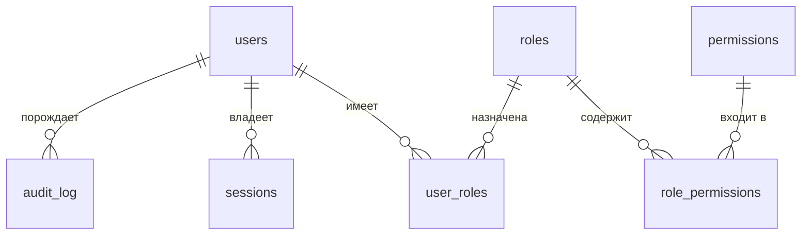

# Auth Service

Собственная система аутентификации и авторизации на FastAPI: регистрация,
вход/выход, управление профилем, мягкое удаление, а также самостоятельно
спроектированная модель разграничения доступа к ресурсам (RBAC) с админ-API
для управления правилами. Механизмы доступа реализованы вручную, а не на
«коробочных» средствах фреймворка.

## Технологический стек

- **Python 3.12**, **FastAPI** (ASGI, async end-to-end)
- **PostgreSQL 16** + SQLAlchemy 2.0 (async) + asyncpg, миграции **Alembic**
- **Redis 7** — rate limiting и хранение серверного состояния
- **nginx** — обратный прокси, L7-лимиты
- **Docker / docker compose** — запуск, тесты, развёртывание
- **Argon2id**, **PyJWT (HS256)** — хэширование паролей и токены

## Быстрый старт

```bash
docker compose up --build
```

Поднимутся `api`, `db`, `redis`, `nginx`. При `SEED_ON_STARTUP=true` (по умолчанию
в `docker-compose.yml`) база наполняется демонстрационными данными. Сервис доступен
через nginx на `http://localhost:8080`, OpenAPI — `http://localhost:8080/docs`.

Демо-пользователи (пароль `ChangeMe-Please-1`):

| Email | Роль | Доступ |
|---|---|---|
| `admin@example.com` | admin | всё, включая admin-API (`rbac:manage`) |
| `manager@example.com` | manager | documents read/create, reports read |
| `user@example.com` | user | documents read |

## Схема управления доступом (RBAC)

Ядро системы — модель **RBAC**: пользователь получает права через роли, а право —
это пара **(resource, action)**. Доступ к ресурсу разрешён, если у пользователя
(через любую из его ролей) есть соответствующее право; суперпользователь имеет
доступ ко всему.

### Таблицы БД

| Таблица | Назначение | Ключевые поля |
|---|---|---|
| `users` | учётные записи | `id`, `email` (CITEXT, unique), `password_hash`, `is_active`, `is_superuser`, `deleted_at`, `failed_login_count`, `locked_until` |
| `roles` | роли | `id`, `name` (unique), `description` |
| `permissions` | атомарные права | `id`, `resource`, `action`, unique `(resource, action)` |
| `role_permissions` | M2M роль↔право | `role_id`, `permission_id` |
| `user_roles` | M2M пользователь↔роль | `user_id`, `role_id`, `granted_at` |
| `sessions` | refresh-сессии | `id`, `user_id`, `family_id`, `token_hash`, `parent_id`, `expires_at`, `revoked_at` |
| `audit_log` | аудит событий безопасности | `id`, `user_id`, `event`, `ip_address`, `event_metadata` |



### Логика проверки доступа

На каждый защищённый запрос:

1. **Идентификация.** Из заголовка `Authorization: Bearer <access>` извлекается и
   проверяется JWT. Если пользователь не определён (токен отсутствует, невалиден,
   просрочен, либо учётка неактивна/удалена) → **401 Unauthorized**.
2. **Авторизация.** Для запрошенного `(resource, action)` проверяется, есть ли у
   пользователя это право (superuser — всегда да). Если пользователь определён, но
   права нет → **403 Forbidden**.
3. Иначе выдаётся запрашиваемый ресурс (**200**).

Управление правилами доступно через admin-API пользователю с правом `rbac:manage`
(в т.ч. роль `admin`). Так «пользователь с ролью администратора» может читать и
изменять правила — создавать права/роли и назначать их.

## API

Базовый префикс — `/api/v1`.

### Аутентификация
| Метод | Путь | Описание |
|---|---|---|
| POST | `/auth/register` | регистрация (ФИО, email, пароль + повтор) |
| POST | `/auth/login` | вход по email+паролю → access + refresh |
| POST | `/auth/refresh` | ротация refresh-токена |
| POST | `/auth/logout` | выход (отзыв семьи сессий) |

### Профиль (требует аутентификации)
| Метод | Путь | Описание |
|---|---|---|
| GET | `/users/me` | текущий профиль |
| PATCH | `/users/me` | обновление профиля |
| POST | `/users/me/change-password` | смена пароля (отзыв всех сессий) |
| DELETE | `/users/me` | мягкое удаление аккаунта |

### Admin RBAC (право `rbac:manage`)
| Метод | Путь | Описание |
|---|---|---|
| GET/POST | `/admin/permissions` | список / создание прав |
| GET/POST | `/admin/roles` | список / создание ролей |
| GET | `/admin/roles/{id}` | роль с правами |
| POST/DELETE | `/admin/roles/{id}/permissions[/{pid}]` | привязка/отвязка права |
| POST/DELETE | `/admin/users/{id}/roles[/{rid}]` | назначение/снятие роли |

### Бизнес-объекты (mock, демонстрация доступа)
| Метод | Путь | Требуемое право |
|---|---|---|
| GET | `/documents` | `documents:read` |
| POST | `/documents` | `documents:create` |
| GET | `/reports` | `reports:read` |
| GET | `/projects` | `projects:read` |

## Аутентификация и сессии

- **Access-токен** — короткоживущий JWT (HS256, ~15 мин) с claim `type=access` и `jti`.
- **Refresh-токен** — непрозрачный; в БД хранится только его SHA-256-хэш.
- **Ротация с обнаружением повторного использования**: каждый refresh выдаёт новый
  токен и отзывает старый; повторное предъявление уже отозванного токена трактуется
  как компрометация и отзывает всю «семью» сессий (`family_id`).
- **logout** и **смена пароля** отзывают сессии; **мягкое удаление** делает вход
  невозможным, а имеющийся access отклоняется на следующем запросе.

## Безопасность

- Пароли — **Argon2id** (memory-hard), в БД никогда не хранится сырой пароль/refresh.
- Секрет подписи ≥ 32 байт; дефолтный секрет запрещён в `prod` (fail-closed).
- Защита от перебора: счётчик неудач + временная блокировка (`locked_until`);
  единый ответ **401** без раскрытия существования учётки (anti-enumeration).
- **Rate limiting** (защита от DDoS): Redis fixed-window по реальному IP (`X-Real-IP`),
  строже на `/auth/*`; превышение → **429 + Retry-After**. Второй рубеж — nginx
  (`limit_req`, `limit_conn`, ограничение размера тела).
- **Security-заголовки** на всех ответах: `X-Content-Type-Options`, `X-Frame-Options`,
  `Referrer-Policy`, `Strict-Transport-Security`, `Cross-Origin-Opener-Policy`.
- Сквозной `X-Request-ID` и структурные JSON-логи.

## Конфигурация

Переменные окружения — см. `.env.example`. Основные: `SECRET_KEY`, `DATABASE_URL`,
`REDIS_URL`, `ACCESS_TOKEN_TTL_SECONDS`, `REFRESH_TOKEN_TTL_SECONDS`,
`RATE_LIMIT_*`, `SEED_ON_STARTUP`.

## Тесты

Прогон линта, типизации и тестов с покрытием — целиком в Docker:

```bash
docker compose -f docker-compose.test.yml up --build --abort-on-container-exit --exit-code-from tests
```

Пайплайн: `alembic upgrade` + `alembic check` (модели == схема) → `ruff` →
`ruff format --check` → `mypy --strict` → `pytest` с порогом покрытия **90%**.

## Нагрузочное тестирование

Инструмент — **k6** в Docker (без локальных установок):

```bash
docker compose -f docker-compose.yml -f docker-compose.load.yml run --rm k6
```

Сценарий (`loadtest/users_me.js`) — `constant-arrival-rate` на `GET /api/v1/users/me`:
ключевой путь ТЗ «идентификация залогиненного пользователя на последующих запросах»
(проверка JWT + одна индексная выборка). На время замера ёмкости rate limiting
отключён, k6 обращается к `api:8000` напрямую.

### Целевые 1000 rps

На dev-окружении (Docker Desktop/WSL2, 8 общих vCPU, где k6, PostgreSQL и Redis
соседствуют с приложением) устойчиво держится порядка **300–400 rps при 0% ошибок**;
потолок задаётся общими ядрами dev-машины и генератором нагрузки на ней же (под
насыщением латентность растёт из-за очереди — значим именно максимальный throughput).

Целевые **1000 rps** — это ориентир для выделенной инфраструктуры, и приложение под
него спроектировано: аутентификация по **stateless JWT** (одна индексная выборка,
без БД для авторизации при попадании в кэш), полностью **async** стек, и
**горизонтальное масштабирование** воркеров/реплик за nginx. На адекватном железе
цель достигается увеличением числа gunicorn-воркеров и реплик `api` (рост throughput
с числом воркеров подтверждён замерами выше).

## Структура проекта

```
app/
  api/            роутеры (auth, users, admin, business) и DI-зависимости
  core/           конфиг, логирование, безопасность (Argon2/JWT), исключения
  db/             engine/session, Redis, seed
  middleware/     request-id, security headers, rate limiting
  models/         SQLAlchemy-модели
  repositories/   доступ к данным
  schemas/        Pydantic-схемы
  services/       бизнес-логика (auth, user, rbac)
alembic/          миграции
docker/           Dockerfile, entrypoint, nginx.conf
tests/            unit + integration
```
